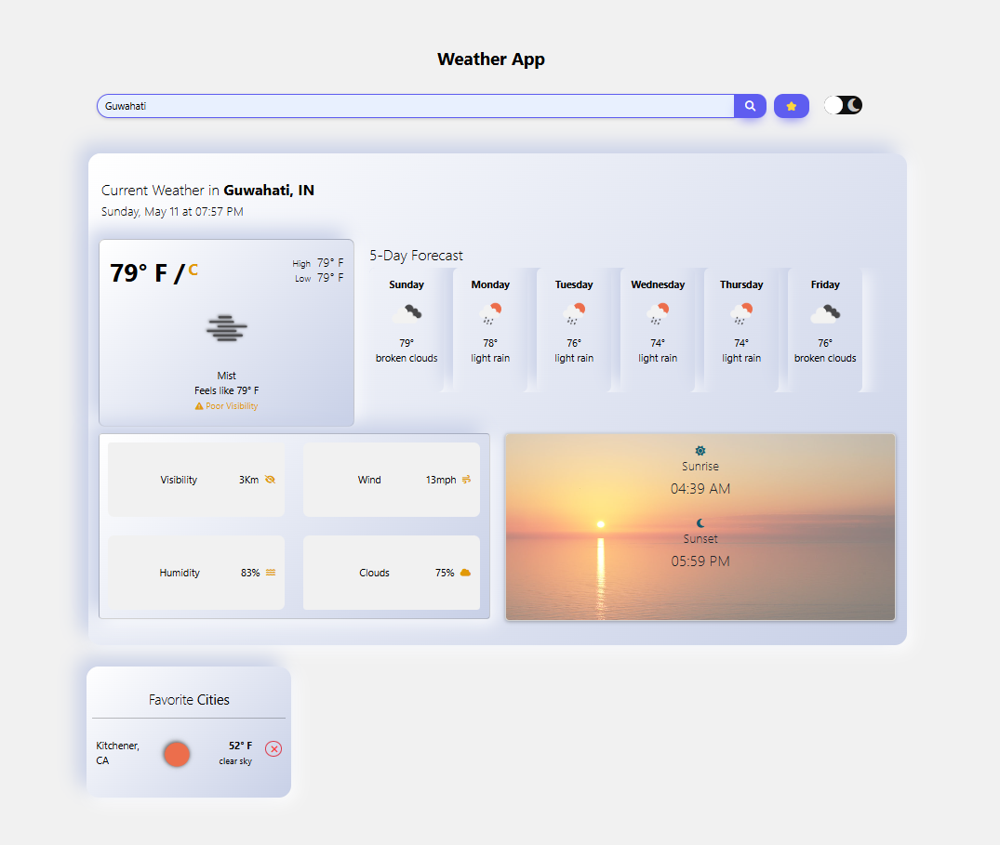

# 🌦️ Weather App

A sleek and responsive weather application that provides real-time weather updates for any city worldwide. Built with HTML, CSS, and JavaScript, this app fetches data from a reliable weather API to display current conditions and forecasts.

## 📁 Project Structure

```

WEATHER-APP/
├── index.html
├── style.css
├── script.js
├── README.md
└── assets/
├── screenshot1.png
└── screenshot2.png

````

## 📸 Screenshots

  


## 📦 Getting Started

### 1. **Clone the Repository**:

```bash
git clone https://github.com/Sadiqueahmed/WEATHER-APP.git
````

### 2. **Navigate to the Project Directory**:

```bash
cd WEATHER-APP
```

### 3. **Open index.html in Your Browser**:

Double-click the `index.html` file.

OR

Use a local development server for a better experience (e.g., Live Server in VS Code).

---

## 🔧 Configuration

To fetch live weather data, you'll need an API key from OpenWeatherMap:

1. **Sign Up**: Create an account on [OpenWeatherMap](https://openweathermap.org/).
2. **Get API Key**: Navigate to the API section and generate a key.
3. **Add API Key**: Open `script.js`. Replace `'YOUR_API_KEY'` with your actual API key:

```javascript
const apiKey = 'YOUR_API_KEY';
```

---

## 📈 Usage

1. **Search for a City**: Enter the city name in the search bar and press Enter.
2. **View Weather Details**: Displays temperature, humidity, wind speed, and description.
3. **Toggle Temperature Units**: Click on the temperature unit to switch between Celsius and Fahrenheit.

---

## 🤝 Contributing

Contributions are welcome! Here's how you can help:

1. **Fork the Repository**.
2. **Create a New Branch**:

```bash
git checkout -b feature/YourFeature
```

3. **Commit Your Changes**:

```bash
git commit -m 'Add YourFeature'
```

4. **Push to the Branch**:

```bash
git push origin feature/YourFeature
```


## 📄 License

This project is licensed under the MIT License.

---

## ✨ Author

**Sadique Ahmed**
GitHub: [@Sadiqueahmed](https://github.com/Sadiqueahmed)
Email: [sadiqueahmed@example.com](mailto:sadiqueahmed@example.com)

Feel free to reach out for any suggestions or collaborations!

```

You can copy and paste this directly into your `README.md` file. Let me know if you'd like any changes!
```
